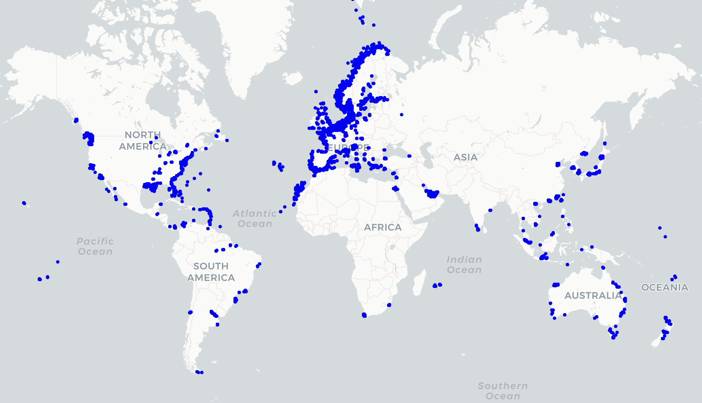

# Automated Identification Systems (AIS) Data: JSON Dataset

This repository contains a curated JSON dataset of AIS (Automated Identification Systems) data from 10,000 vessels, reduced from an original dataset of over 42,000 vessels. AIS data is used for understanding vessel traffic, maritime navigation, and global shipping patterns. The purpose of this dataset is for training.




## Data Source
This data was obtained from [AISHUB](https://www.aishub.net/), a leading provider of community-sourced AIS data.


## Introduction

AIS is a VHF-based system that transmits vessel information such as position, course, speed, and navigational status. This dataset was extracted, cleaned, and reduced to provide a manageable yet diverse subset of maritime data for analysis and development.

The dataset captures a broad range of vessel activity and includes fields such as MMSI, time stamp, latitude, longitude, vessel type, and more.

## Dataset Highlights

- **Total Vessels**: 10,000
- **Format**: JSON
- **Data Origin**: Extracted from AISHUB and processed using Python.

### Example Data
```json
{
    "MMSI": "257465900",
    "TSTAMP": "2024-11-19 20:28:06 GMT",
    "LATITUDE": "63.43565",
    "LONGITUDE": "10.39761",
    "COG": "137.6",
    "SOG": "0",
    "HEADING": "511",
    "NAVSTAT": "15",
    "IMO": "0",
    "NAME": "D/S HANSTEEN",
    "CALLSIGN": "LDQF",
    "TYPE": "60",
    "A": "20",
    "B": "10",
    "C": "3",
    "D": "2",
    "DRAUGHT": "0",
    "DEST": "",
    "ETA": "00-00 00:00"
}
```

## Fields Description

- **MMSI**: Unique identifier for each vessel.
- **TSTAMP**: Time of AIS signal transmission in GMT.
- **LATITUDE & LONGITUDE**: Vessel’s geographic position.
- **COG & SOG**: Course and speed over ground, respectively.
- **HEADING**: Direction the vessel is pointing.
- **NAVSTAT**: Navigational status based on COLREGS.
- **IMO**: International Maritime Organization number, where available.
- **NAME**: Vessel's name.
- **CALLSIGN**: Vessel's call sign.
- **TYPE**: Vessel type code.
- **DRAUGHT**: Vessel's draft in meters.
- **DEST**: Destination, if entered.
- **ETA**: Estimated time of arrival.

## Use Cases

- **Maritime Navigation**: Analyze vessel movement patterns.
- **Traffic Management**: Support collision avoidance and traffic optimization.
- **Emissions Reporting**: Enable sustainability tracking by monitoring vessel activities.
- **Data Science Projects**: Develop machine learning models for route prediction and anomaly detection.

## Contribution

If you'd like to contribute:

- Submit issues or enhancements via the [GitHub Issues page](#).
- Fork the repository and submit pull requests with updates.

## Contact

If you have any questions or would like to contribute, please reach out via [LinkedIn](https://www.linkedin.com/in/tayljordan/).

